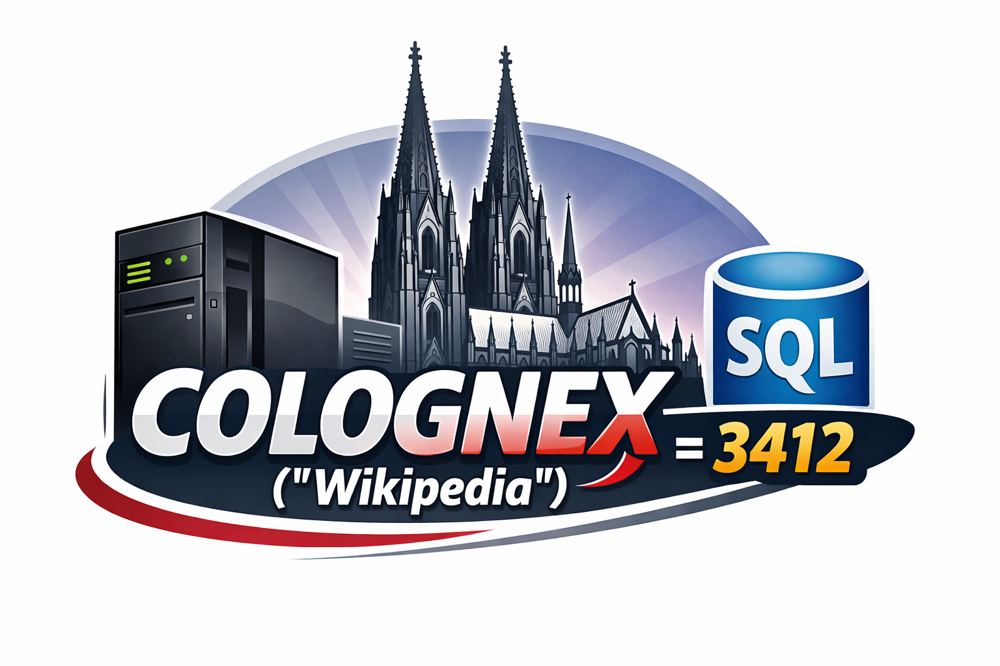

# COLOGNEX



## Description

Implementation of the "Kölner Phonetik" (Cologne Phonetics) algorithm as RPGLE service program for the IBM i. Source for a user defined SQL function that uses this serviceprogram included.

The "Kölner Phonetik" is a phonetic algorithm for the German language, similar to "SOUNDEX" for English. That's the reason for the Name "COLOGNEX".

See the wikipedia articles for details:

- [Kölner Phonetik](https://de.wikipedia.org/wiki/K%C3%B6lner_Phonetik)
- [SOUNDEX](https://en.wikipedia.org/wiki/Soundex)

## Installation

Copy the contents of the repository to your IBM i. This can be done in several ways. If your IBM i can access github and you have git installed, you can clone the repository directly on the IBM i. Otherwise, you can download the repository as a zip file and transfer it to the IBM i using FTP or any other file transfer method and unzip it then.

In this example we assume that the repository is copied to the directory `/home/myuser/colognex` on the IBM i and the objects shall be created in library `MYLIB`.

Change the current directory to this one

```CLLE
 CHGCURDIR '/home/myuser/colognex'
```

and execute the following commands.

```CLLE
 CRTRPGMOD MODULE(MYLIB/COLOGNEX)
           SRCSTMF('/home/myuser/colognex/QRPGSRC/COLOGNEX.SQLRPGLE')
           TGTCCSID(*JOB)

 CRTSRVPGM SRVPGM(MYLIB/COLOGNEX) EXPORT(*ALL)
```

To create the user defined SQL function, execute the following command in STRSQL or the "Db2 for i" extension for VS Code or "Run SQL Scripts" in ACS:

```SQL
 CREATE OR REPLACE FUNCTION MYLIB.COLOGNEX
    (CLEARTEXT VARCHAR(512))
  RETURNS VARCHAR(512)
  LANGUAGE RPGLE
  NOT DETERMINISTIC
  NO SQL
  EXTERNAL NAME 'MYLIB/COLOGNEX(COLOGNEX)'
  PARAMETER STYLE GENERAL
  PROGRAM TYPE SUB
```

If you use this heavily, you might want to remove the "NOT" in front of the "DETERMINISTIC" clause, because the function is in fact deterministic. This can improve performance in some cases, because the database engine can cache the results for previously seen inputs. But if you plan to change the implementation of the function, you should keep it as "NOT DETERMINISTIC" to avoid caching of results that might become incorrect after the change!

You can then test the function with the following SQL statement:

```SQL
    VALUES MYLIB.COLOGNEX('Wikipedia')
```

This should return the phonetic code for "Wikipedia", which is `3412`.

## Usage

The service program can be used in RPGLE programs, but also as a user defined SQL function. The latter is the most common use case, because it allows to use the algorithm in SQL queries, for example to find similar sounding names in a database.

## best practices for comparison

To make this work best, you might want to consider one or more of the following points:

- do not include titles or degress in the strings you want to compare, just the name(s).
- always use the same format for the names, for example "Firstname Lastname" or "Lastname, Firstname". Or, from a performance point of view, create two fields in the database, one for the first name and one for the last name, and compare them separately.
- if you want to compare your data on a regular basis to lists, consider storing the phonetic code in the database as well, so you don't have to calculate it every time. You can use a trigger to automatically calculate and store the phonetic code when a new record is inserted or an existing record is updated.
- needless to say, but be aware that the algorithm is not perfect and might produce false positives or false negatives. It is always a good idea to manually review the results of the comparison, especially if you are using it for critical applications.
